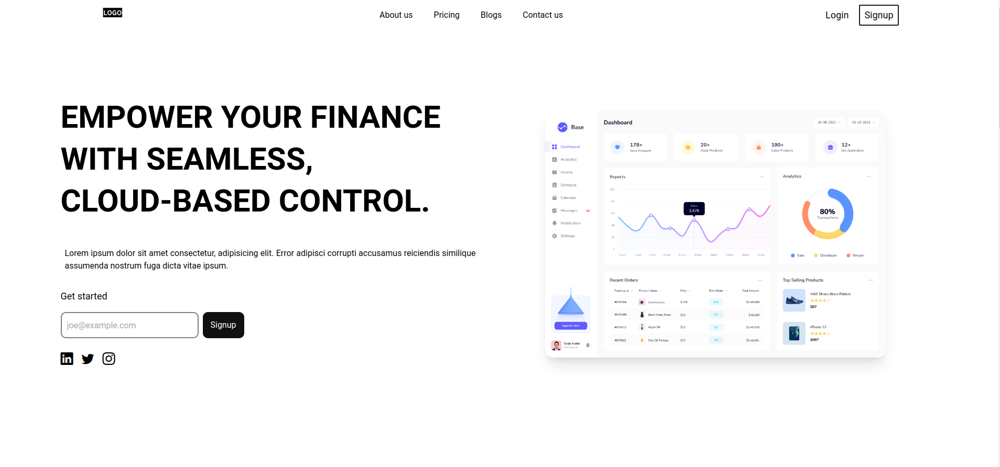

# Free Landing page templates

Contains free and open-sourced website templates, including but not limited to SaaS landing page, portfolio page and more. Useful, for freelancers, SaaS developers, and more.

Feel free to star this repository. More templates wil be uploaded from time to time.

## Features
* Responsive
* Tailwind built it (uses tw- to separate tailwind classes)
* Quick customization.
* Frontend framework independent: Comes with basic html, css just enough for your perfect landing page, you are free to modify and use any frontend framework (React, Vue) if required.

## Whom is this suitable for?
* Developers who have tight deadlines.
* Freelancers looking to show a prototype
* SaaS Developers who don't want to spend too much time focusing on landing page, but instead want to ship more.
* People who are learning HTML, css and JS 


## Installation and setup
Installation and set up is same for almost all the templates

### Cloning the folder you want
1. First go into a directory of your choice and use the following command 
```
git clone --filter=blob:none --sparse  https://github.com/PaulleDemon/landing-pages
 ```
The above command will clone a empty repo. So now cd inside the repo 
``` 
cd %the repository directory%
```
Now
```
git sparse-checkout add saas/finance
``` 
read more on this [Stackoverflow answer](https://stackoverflow.com/a/73254328/15993687)


1. If you are planning to modify tailwind you must have node installed.

> [!NOTE] 
> Install dependencies from `.package.json` not package.json, as package.json contains additional dependencies to help with types

2.Add a file called `tailwind.config.js`
```js
module.exports = {
	prefix: 'tw-',
	important: false,
	content: [
		"./**/*.{html, jsx, js}",
	],
	theme: {
		extend: {},
	},
	plugins: [],
}
```
3. Now add `postcss.config.js
```js
module.exports = {
  plugins: {
    "postcss-import": {},
    "postcss-simple-vars": {},
    "postcss-nested": {}
  },
}
```
4. You should also have a base tailwind file called `tailwind.css`
```css
@tailwind base;
@tailwind components;
@tailwind utilities;

@layer components{
}
```
5. To run the tailwind use `npm run start-css`
6. To build the tailwind use `npm run build:tailwind`

During development add the following to head tag
```
<link rel="stylesheet" href="tailwind-runtime.css"><!--replace with path to your tailwind runtime-->
```
During production use 
```
<link rel="stylesheet" href="tailwind-build.css"><!--replace with path to your tailwind build-->
```


## Website Templates

Here's the list of website templates


### SaaS landing pages



1. [Simple Finance](saas/finance) - [[Live preview](https://finance-saas-template.netlify.app/)]


## Brand icons from
https://brandfetch.com/